<h1 align="center">Luis Sanchez</h1>

<h3 align="center">💻 Fullstack Developer | 🧠 Data Scientist | 🎓 Computer Engineer | ⚙️ DevOps</h3>

  With over 6 years of experience in software development and DevOps, I've built scalable platforms across various sectors, including <strong>mining</strong>, <strong>agriculture</strong>, and <strong>finance</strong>.  
  My core stack includes <strong>JavaScript (React/Node.js)</strong>, <strong>Python (Flask/Django/Dash)</strong>, <strong>Java (Spring Boot)</strong>, and DevOps tools like <strong>Docker, Jenkins, and GitHub Actions</strong>.

---

  
  <a href="https://twitter.com/hlcxpl">
    
  

---

## 🧑‍💻 About Me
- 🎓 I'm a **Computer Engineer** with 5+ years of industry experience.
- 🌱 Exploring: **Python, Angular, Vue, Laravel, Flutter, NLP, Deep Learning**.
- 🧠 Passionate about **system automation, backend architecture, and ML solutions**.
- 💬 Ask me about **Flask, Java, Spring Boot, React, Dash, Docker, Jenkins, ML**.
- 👯 Looking to collaborate on **DevOps pipelines, AI/ML apps, or backend APIs**.
- 📫 Contact me at **hlcxpl@gmail.com**

💼 I've built applications for Mining, Finance, Agriculture, and Smart Water Management industries.

🌍 Originally from Venezuela 🇻🇪, based in Chile 🇨🇱, working remotely 🌐.
---

### 📂 Devops Templates Projects
<!-- Update with your pinned repos or recent projects -->
- 🔗 [devops-selenium-pytest](https://github.com/hlcxpl/devops-selenium-pytest) - Selenium tests with CI/CD
- 🔗 [cookiecutter-flask-api-env-rooted](https://github.com/hlcxpl/cookiecutter-flask-api-env-rooted) - Flask API template with JWT & Swagger

---

## 🚀 GitHub Stats & Badges

  
  

  
  

  

---

## 🧰 Tech Stack

### 🖥️ Frontend

  

---

### ⚙️ Backend

  

---

### ☁️ Infraestructura en la Nube

  

---

### 🔄 Messaging & Streaming

  

---

#### 🧩 ORMs

  
  
  

---

#### 🗄️ Databases

  
  
  

---

### 📊 Data Science / AI

---

### 🧪 DevOps & Automation

  

---

### 🔍 Monitoring & Observability

  
  
  

---

### 🖥️ Sistemas Operativos

  

---

### 🧰 IDEs & Editors

  

---

### 📦 Package Managers

  

## 📬 Connect with Me

---

### ☕ Support Me

